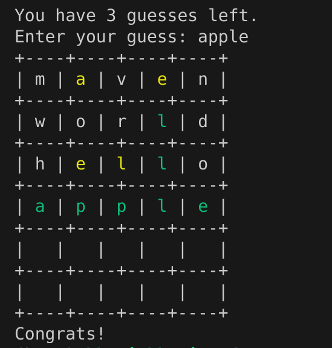

# Abstract games

A mini-project for Grinnell's CSC-207.

## Authors:

- Khanh Do
- Andrew Fargo
- Samuel A. Rebelsky (Starter code)

## Acknowledgements:

Wordle is a game initially hosted on the website <https://powerlanguage.co.uk> which
is now owned and hosted by the New York Times: <https://www.nytimes.com/games/wordle/index.html>.

Implementation of Matrices comes from Khanh's Mini Project 6 submission, you may view the code at <https://github.com/khanhdo05/mp-matrices-maven>.

The wordlist consists of the first 430 words of Donald Knuth's Stanford GraphBase file sgb-words.txt; the checklist is all 5757. These were introduced as supplements to Donald Knuth's *The Art of Computer Programming*, Volume 4: Combinatorial Algorithms.
You may find these words, and other Stanford GraphBase items, here: <https://www-cs-faculty.stanford.edu/~knuth/sgb.html>

*A note on the words:* As the words go further into the file (thus rarer), contain explatives.
While I don't agree with the choice of including explative words in an educational resource, 
I hope that since it is the unabridged version of Donald Knuth's list, it is acceptable.

## Source:

This code may be found at <https://github.com/andrewfargo/mp-games-maven>. It is based on code found at <https://github.com/Grinnell-CSC207/mp-games-maven>.

# Wordle

Welcome to the Wordle! This is a command-line implementation of the popular word-guessing game.

## Introduction

Wordle is a word-guessing game where the player has to guess a 5-letter word within 6 attempts. After each guess, the player receives feedback in the form of colored tiles indicating whether the letters are in the correct position, present in the word but in the wrong position, or not present in the word at all.

## Features

- Command-line interface
- Random word selection from a predefined list
- Feedback on guesses with colored tiles
- Option to view game instructions and statistics

## Installation

### Prerequisites

Before you begin, ensure you have met the following requirements:

- You have installed [Java Development Kit (JDK)](https://www.oracle.com/java/technologies/javase-jdk11-downloads.html) version 11 or later.
- You have installed [Apache Maven](https://maven.apache.org/install.html).
- You have a terminal or command prompt to run the game.

### To install and run the Wordle game, follow these steps:

1. Clone the repository:

   ```sh
   git clone https://github.com/andrewfargo/mp-games-maven
   cd mp-games-maven
   ```

2. Compile the Java files:

   ```sh
   mvn clean compile package -q
   ```

3. Run the game:
   ```sh
   mvn exec:java
   ```

### Usage

When you run the game, you will be presented with the following options:

1. Play
2. See Stats
3. Instructions
4. Quit
5. Configure

To select an option, type the corresponding number and press Enter.

## Playing the Game

- By default you have 6 attempts to guess the 5-letter target word.
- After each guess, you will receive feedback:

  - **GREEN**: The letter is in the correct position.
  - **YELLOW**: The letter is in the word but in the wrong position.
  - **WHITE**: The letter is not in the word.

    
